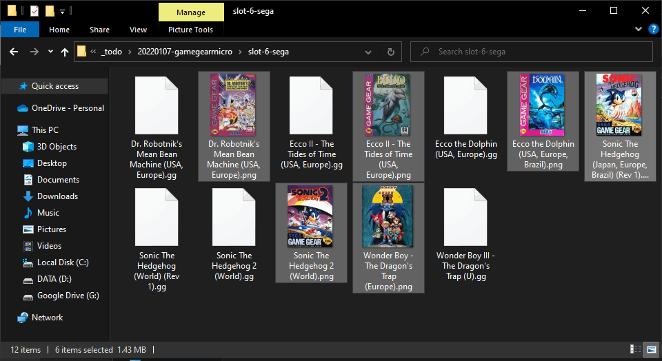
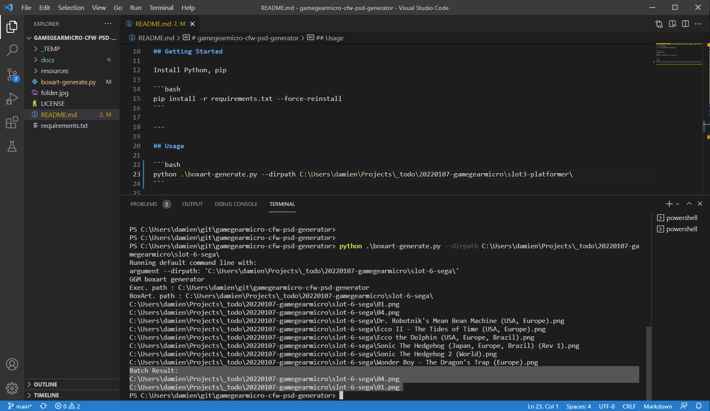
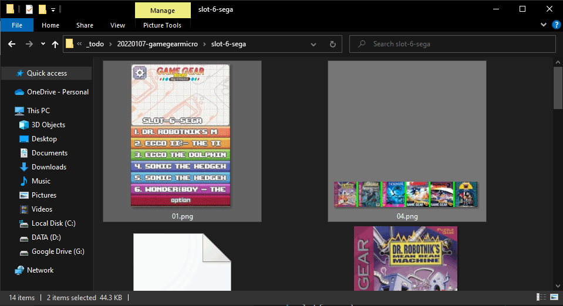
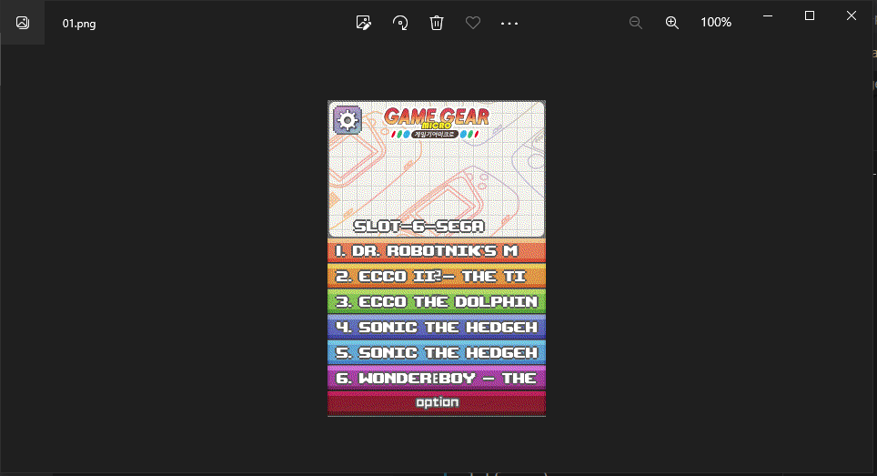
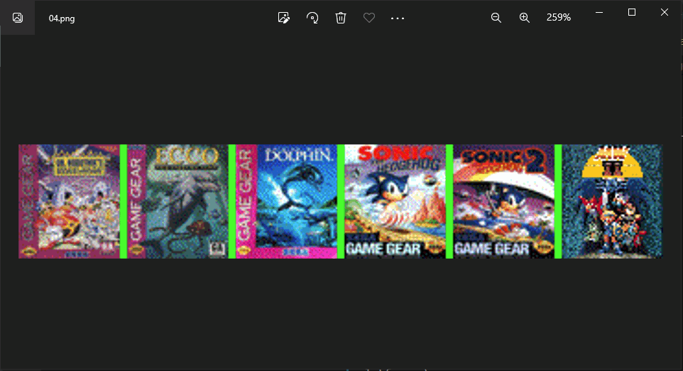
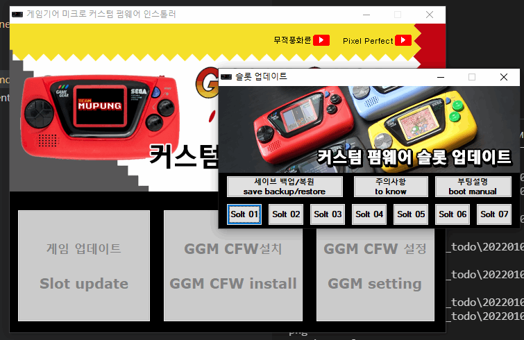
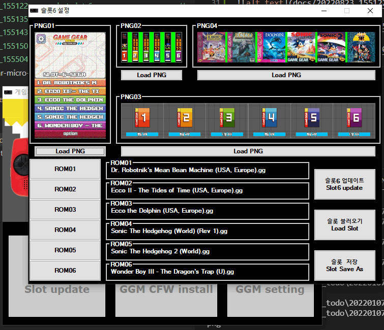

# gamegearmicro-cfw-psd-generator

BoxArt file generator for : Gamegear micro custom firmware can hold a total of 42 games. (6 games X 7 slots)


---

## Getting Started

Install Python, pip

```bash
pip install -r requirements.txt --force-reinstall
```

---

## Usage

```bash
python .\boxart-generate.py --dirpath C:\Users\damien\Projects\_todo\20220107-gamegearmicro\slot3-platformer\
```















---

## Resources

- https://github.com/Project-Lunar/Project-Lunar-Issue-Tracker/releases/

- https://www.youtube.com/watch?v=7FJvevOt_wc

- PNG
  - 01.png : 45kb
  - 02.png :  6kb
  - 03.png : 15kb
  - 04.png : 34kb